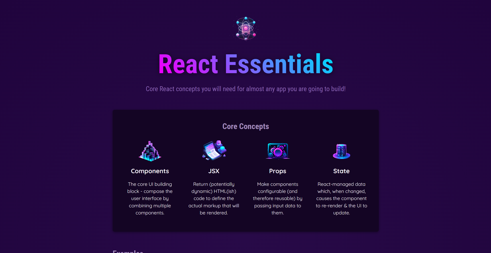
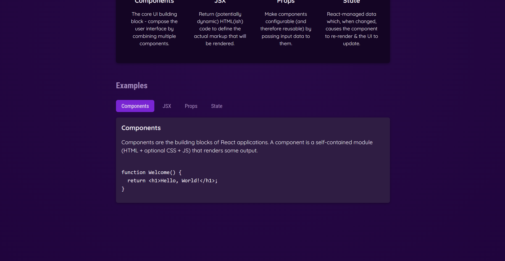
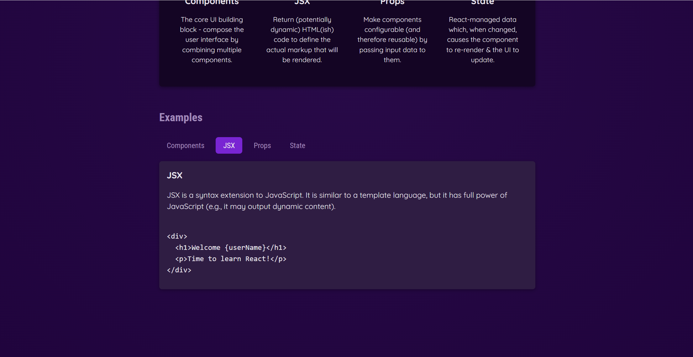
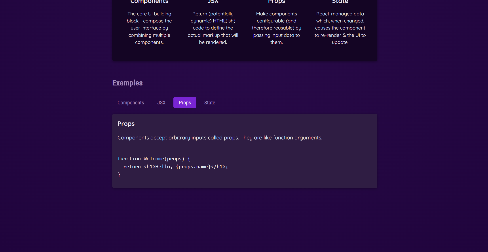
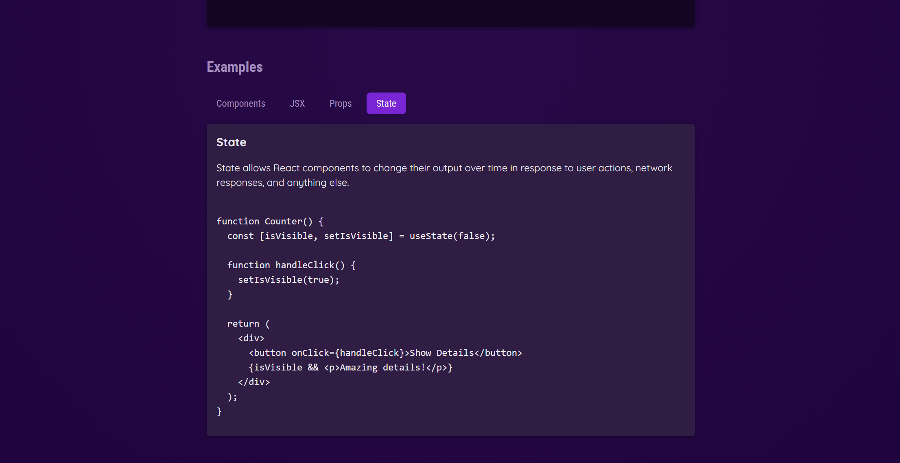

# Web App Explaining Essentials of Web Development Using React

**Project Overview**

This React application aims to provide a comprehensive explanation of fundamental concepts essential for learning React JS. Built using Vite, the app offers interactive and visual demonstrations of key topics.

**Key Features**

**Clear and concise explanations:** In-depth coverage of React fundamentals. 
**Interactive demonstrations:** Hands-on experience with React concepts. 
**Visual aids:** Snapshots and diagrams to enhance understanding. 
**Vite-powered development:** Fast build times and hot module replacement for efficient development. 

